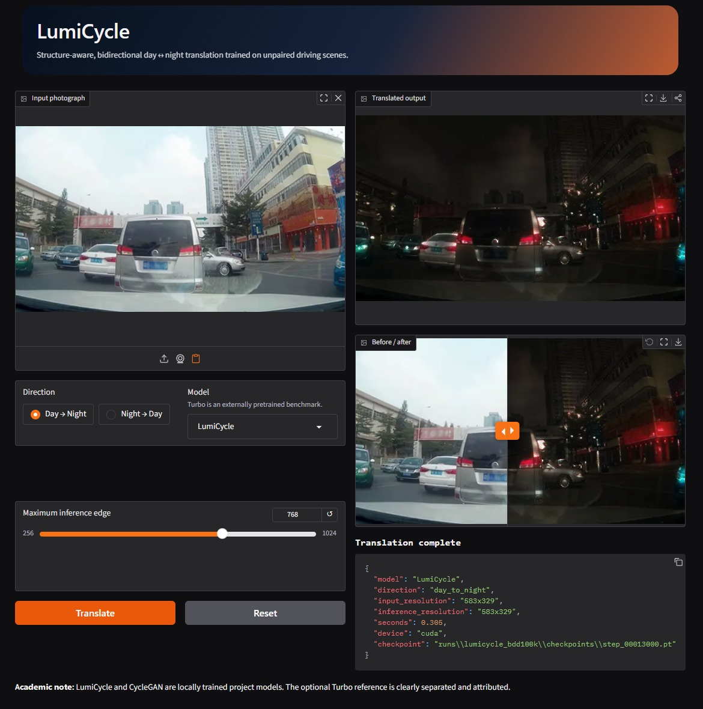

# LumiRender / LumiCycle: Physics-Guided Day ↔ Night Translation

**Current research model:** LumiRender is a new, from-scratch, day→night architecture that explicitly predicts scene factors, composes eight spatially constrained Gaussian lights, renders material-aware reflections and bloom, and simulates a nighttime camera. LumiCycle V1/V2 remain reproducible baselines; V2 serves night→day until a physics-guided reverse model is developed.

LumiRender is not a continuation of any CycleGAN checkpoint. Its originality claim is the local factorizer–composer–renderer–camera integration and the constrained training/evaluation protocol—not the invention of inverse rendering, RAFT, Depth Anything, Mask2Former, or Gaussian kernels.

LumiCycle is a complete college research project for translating unpaired road-scene images in both directions:

- Day → Night
- Night → Day

It includes a locally implemented CycleGAN baseline, the team’s enhanced LumiCycle model, resumable overnight training, quantitative evaluation, an optional external CycleGAN-Turbo benchmark, and an offline Gradio demonstration.

The implementation is based on the supplied 2025 IEEE paper *Unpaired Day-to-Night Image Translation Using Deep Generative Model*. Unlike the paper’s NAS procedure, LumiCycle keeps validation and test images out of training and selects checkpoints using validation data only.



The first complete 40,000-step run selected step 13,000 as its best validation checkpoint. See [PROJECT_PROCESS.md](PROJECT_PROCESS.md) for the full build diary, actual timings, results, plateau analysis, and exact reproduction commands.

Phase-two fine-tuning starts from those best weights but resets the exhausted optimizer state:

```powershell
python -m daynight.train --config configs/lumicycle_phase2.yaml --init-from runs/lumicycle_bdd100k/checkpoints/step_00013000.pt --max-hours 8
```

The sky-aware V2 experiment also resets the saturated critics, adds a whole-image
illumination critic, and trains the discriminators every second generator update:

```powershell
python -m daynight.train --config configs/lumicycle_v2.yaml --init-from runs/lumicycle_bdd100k/checkpoints/step_00013000.pt --pilot
```

V2.1 is retained only as a failed scientific ablation. Its structure losses suppressed the lighting transformation, so it is not an active training recommendation. Its ignored checkpoints and comparisons remain available for honest reporting.

## LumiRender quick path

Install the optional offline-teacher tools, cache BDD factorization targets, and train the held-out night evaluator once:

```powershell
python -m pip install -e ".[teachers]"
python -m daynight.prepare_teacher_targets --data-root data/bdd100k_daynight
python -m daynight.night_classifier --data-root data/bdd100k_daynight
```

Large datasets stay outside Git. KaggleHub is the reliable downloader for public Kaggle copies;
set its cache to drive D so the system disk is not filled:

```powershell
$env:KAGGLEHUB_CACHE="D:\datasets\kagglehub"
python -m pip install -e ".[datasets,teachers]"
python -c "import kagglehub; kagglehub.dataset_download('khalilusmanuk/acdc-clean-dataset-for-training')"
python -c "import kagglehub; kagglehub.dataset_download('stevemark/daynight-dataset')"
```

Kaggle's cleaned ACDC copy omits the official normal-condition references, so it is registered
honestly as unpaired real-night data. Dark Zurich provides the confidence-aligned paired supervision:

```powershell
python -m daynight.prepare_acdc_kaggle --acdc-root D:\datasets\kagglehub\datasets\khalilusmanuk\acdc-clean-dataset-for-training\versions\1
python -m daynight.prepare_dark_zurich --dark-zurich-root D:\datasets\lumirender\Dark_Zurich_train_anon --split train --output D:\datasets\lumirender\dark_zurich_train_pairs.csv
python -m daynight.align_lumirender_pairs --pairs-csv D:\datasets\lumirender\dark_zurich_train_pairs.csv --output D:\datasets\lumirender\aligned\dark_zurich
python -m daynight.prepare_lumirender_data --pairs-csv D:\datasets\lumirender\aligned\dark_zurich\aligned_pairs.csv --source dark_zurich
python -m daynight.prepare_amos --amos-root D:\datasets\kagglehub\datasets\stevemark\daynight-dataset\versions\1 --output D:\datasets\lumirender\amos_pairs.csv
```

Run the strict preflight after registering sources. It refuses to start the factorization stage without teacher targets and refuses to enter correspondence training without licensed pairs:

```powershell
python -m daynight.preflight_lumirender
```

Before final acceptance, create a CSV with `category,image_path` and at least one image in every required difficult-scene category, then register it:

```powershell
python -m daynight.prepare_lumirender_suite --csv D:\datasets\lumirender_suite.csv
```

Blind the model labels in the exported comparison gallery and collect a team CSV with columns `reviewer,sample,night_realism,unchanged_geometry,light_placement,reflections,artifacts`; each vote is `lumirender`, `v2`, or `tie`. Then score it with `python -m daynight.score_blind_review --csv <file>`.

Run a 500-step low-risk pilot, then resume multi-night training:

```powershell
./scripts/start_lumirender_tonight.ps1 -Hours 8

# Or run the two stages manually:
python -m daynight.train_lumirender --config configs/lumirender.yaml --pilot
python -m daynight.train_lumirender --config configs/lumirender.yaml --max-hours 8 --resume auto
```

The four stages are 5k factorization/reconstruction steps, 10k randomized physics steps, 8k correspondence steps at 256→384 px, and 5k real-night refinement steps. LumiRender is added to Gradio only after the acceptance evaluator passes:

```powershell
python -m daynight.evaluate --checkpoint runs/lumirender_physics_bdd100k/checkpoints --output outputs/evaluation/lumirender
python -m daynight.evaluate_lumirender --checkpoint runs/lumirender_physics_bdd100k/checkpoints
```

See [the fundamentals chapter](docs/LUMIRENDER_FUNDAMENTALS.md), [245-record literature screen](docs/LUMIRENDER_LITERATURE_SCREEN.csv), and [30-paper implementation review](docs/LUMIRENDER_LITERATURE_REVIEW.md).

## What is original in this project?

LumiCycle does not claim that the team invented CycleGAN, attention, DINOv2, or contrastive learning. The project contribution is the tested integration of:

- Channel-and-spatial attention in both translation generators.
- Multi-scale, spectral-normalized discriminators.
- Patchwise contrastive content preservation.
- Frozen DINOv2 semantic preservation.
- Edge preservation for lanes, vehicles, signs, and scene geometry.
- EMA inference weights and reproducible, plateau-aware overnight training.
- Leakage-resistant BDD100K preparation and evidence beyond visual examples.

## Repository map

```text
daynight/                    Python package
  prepare_data.py            BDD100K validation, filtering, duplicate-safe splitting
  models/                    CycleGAN, LumiCycle and LumiRender networks
  trainer.py                 Losses, training, monitoring, recovery and resume
  inference.py               Stable translate(image, direction, model) API
  evaluate.py                FID, KID, DINO, edge and optional detector metrics
  lumirender_trainer.py      Four-stage physics-guided training
  prepare_teacher_targets.py Offline depth/semantic pseudo-label generation
  align_lumirender_pairs.py  Frozen-RAFT alignment and occlusion confidence
configs/                     Reproducible experiment configurations
scripts/                     Windows setup, training, evaluation and demo commands
tests/                       Unit and CUDA smoke tests
docs/                        Architecture, report, viva and presentation material
PROJECT_PROCESS.md           Beginner-friendly build diary and replication guide
app.py                       Offline Gradio showcase
```

## 1. Requirements

- Windows 10/11
- NVIDIA GPU with at least 10 GB VRAM; tested for an RTX 4070 Super 12 GB target
- 32 GB system RAM recommended
- At least 50 GB free disk space
- Python 3.12
- Current NVIDIA driver

Close GPU-heavy programs before training. In Windows power settings, prevent automatic sleep while plugged in. The monitor may turn off; the computer must not sleep.

## 2. Install

Open PowerShell in this folder:

```powershell
Set-ExecutionPolicy -Scope Process Bypass
.\scripts\setup.ps1
```

The script creates `.venv`, installs the pinned CUDA build of PyTorch, installs the project, and prints a hardware report.

Activate the environment in future terminals:

```powershell
.\.venv\Scripts\Activate.ps1
```

Verify the computer at any time:

```powershell
python -m daynight.doctor
```

## 3. Download BDD100K legally

1. Open the official [BDD100K download page](https://bdd-data.berkeley.edu/).
2. Create/sign in to an account and accept the dataset terms.
3. Download and extract **100K Images**.
4. Download and extract the **Labels** archive containing train and validation JSON labels.
5. Put both anywhere with enough space. They may be nested; the preparation tool searches recursively.

If the Berkeley portal is temporarily unavailable, the preparation tool also supports the
per-image JSON layout used by the [BDD100K Kaggle mirror](https://www.kaggle.com/datasets/alvaromalfaro/bdd100k).
Review the displayed BDD100K license before downloading; do not redistribute the archive.

Example only:

```text
D:\datasets\bdd100k\
  images\100k\train\*.jpg
  images\100k\val\*.jpg
  labels\*.json
```

Do not commit BDD100K to Git or redistribute it.

Prepare strict day/night splits:

```powershell
python -m daynight.prepare_data --bdd-root "D:\datasets\bdd100k"
```

The command creates small manifests under `data/bdd100k_daynight`, not copies of the images. Defaults are 5,000+5,000 training, 500+500 validation, and 1,000+1,000 test images. Review `data/bdd100k_daynight/review/*.jpg` and `dataset.json` before training.

Quality flags are reported but test samples are never silently deleted. Perceptual-hash duplicate groups are assigned to one split only.

## 4. Preflight before a long run

Run automated tests and the 32-image overfit check:

```powershell
.\scripts\run_preflight.ps1
```

Then run the isolated 2,000-step pilot:

```powershell
python -m daynight.train --config configs\lumicycle.yaml --pilot --max-hours 8 --resume auto
```

Open training graphs and fixed image grids:

```powershell
tensorboard --logdir runs
```

For a beginner-friendly live text view with progress, ETA, plain-English health
messages, and current GPU usage, run this in a second terminal:

```powershell
python monitor.py
```

Then open `http://127.0.0.1:7861`. The page refreshes automatically.

Do not begin the full run until the pilot produces non-constant outputs, finite losses, visible lighting change, and stable memory usage.

## 5. Train overnight and resume safely

Baseline CycleGAN:

```powershell
.\scripts\train_overnight.ps1 -Model cyclegan -Hours 8
```

LumiCycle:

```powershell
.\scripts\train_overnight.ps1 -Model lumicycle -Hours 8
```

Run the same command on each night. `--resume auto` restores the complete state. When the time budget ends—or when Ctrl+C is pressed—the trainer atomically saves:

- Generators and discriminators
- EMA generator weights
- Optimizers and schedulers
- Replay buffers
- Random-number states
- Step, configuration hash, best score, and recovery history

Checkpoint selection uses validation cycle/edge preservation, never test data. If validation stagnates four times, the trainer restores the best weights and halves the learning rates. NaN and GPU-memory failures preserve a diagnostic report and attempt a safe rollback, with a maximum of three automatic recoveries.

The first LumiCycle run downloads official DINOv2-S weights through PyTorch Hub. Allow this once before relying on offline training.

## 6. Evaluate without cherry-picking

Install the optional frozen detector:

```powershell
python -m pip install -e ".[detector]"
```

Evaluate both locally trained models:

```powershell
.\scripts\evaluate_all.ps1
```

Results are saved as JSON and sample translations under `outputs/evaluation`. Report:

- FID and KID for target-domain distribution similarity.
- DINO distance and Sobel edge distance for structure.
- Frozen-detector object retention and confidence ratio.
- Latency and peak VRAM.

FID/KID require enough examples to be meaningful. Use the full untouched test split for final tables. Do not use PSNR/SSIM as primary unpaired metrics because the input and target scenes are not aligned.

## 7. Optional modern benchmark

The official Turbo model is an external pretrained reference, not the team’s contribution.

```powershell
.\scripts\setup_turbo_reference.ps1
```

Its upstream code and weights come from [GaParmar/img2img-turbo](https://github.com/GaParmar/img2img-turbo). Keep its results in a clearly labeled “external pretrained” column. If upstream dependency changes cause incompatibility, the core project and demo remain functional without it.

## 8. Launch the offline demo

After training:

```powershell
.\scripts\launch_demo.ps1
```

The browser opens at `http://127.0.0.1:7860`. The app provides upload/webcam/clipboard input, translation direction, model selection, maximum resolution, a before/after comparison, download, and inference metadata.

For the college showcase:

1. Launch while internet is available once so all model caches exist.
2. Disconnect the network and test LumiCycle in both directions.
3. Keep backup comparison screenshots in the presentation folder.
4. Use LumiCycle as the default. Only select Turbo when explaining the benchmark.

## Stable commands

```powershell
python -m daynight.prepare_data --bdd-root <path>
python -m daynight.train --config configs\cyclegan.yaml --max-hours 8 --resume auto
python -m daynight.train --config configs\lumicycle.yaml --max-hours 8 --resume auto
python -m daynight.evaluate --checkpoint runs\lumicycle_bdd100k\checkpoints
python app.py
```

Public Python API:

```python
from PIL import Image
from daynight.inference import translate

output, metadata = translate(
    Image.open("day_scene.jpg"),
    direction="day_to_night",
    model_name="LumiCycle",
)
output.save("night_scene.jpg")
print(metadata)
```

## Common problems

### CUDA out of memory

- Close games, browsers, Wallpaper Engine, and GPU overlays.
- Keep batch size at 1 and gradient accumulation at 2.
- Do not increase training resolution before the 256 px experiment is complete.
- In the demo, reduce the maximum edge to 512.

### Training looks unchanged

- Confirm day and night contact sheets are correctly labeled.
- Inspect adversarial, cycle, identity, edge, and NCE losses separately.
- Check `health/output_variance` and discriminator accuracy in TensorBoard.
- Use the fixed validation grid; random examples make progress difficult to judge.
- Do not restart from scratch unless diagnostics prove the checkpoint is corrupt.

### Training stopped during the night

Rerun the same command. Check `runs/<experiment>/diagnostics` first. The atomic checkpoint means an interrupted temporary file cannot replace the last good checkpoint.

### Dataset or checkpoint not found

Paths containing spaces must be quoted. Run `python -m daynight.doctor` and confirm `dataset_prepared` is true.

## Research integrity and limitations

- Night-to-day translation cannot recover information that the camera never captured.
- Generators can hallucinate, remove, or alter safety-relevant objects; outputs must not control a vehicle.
- Attractive images do not prove semantic correctness, so the project reports structural and detector evidence.
- Results depend on BDD100K’s geography, cameras, weather, and class balance.
- Turbo results depend on external pretrained knowledge and must remain attributed.

See [docs/REPORT.md](docs/REPORT.md), [docs/ARCHITECTURE.md](docs/ARCHITECTURE.md), [docs/VIVA.md](docs/VIVA.md), and [docs/PRESENTATION.md](docs/PRESENTATION.md) for the college package.

## References

1. Zhu et al., “Unpaired Image-to-Image Translation using Cycle-Consistent Adversarial Networks,” ICCV 2017.
2. Park et al., “Contrastive Learning for Unpaired Image-to-Image Translation,” ECCV 2020.
3. Oquab et al., “DINOv2: Learning Robust Visual Features without Supervision,” 2023.
4. Parmar et al., “One-Step Image Translation with Text-to-Image Models,” 2024.
5. Hara and Chen, “Unpaired Day-to-Night Image Translation Using Deep Generative Model,” IEEE GCCE 2025.
6. Alam, Singh, and Bazilinskyy, “A Survey of Day-Night Illumination Domain Translation for Outdoor Vision,” 2026.
