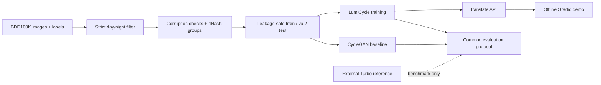
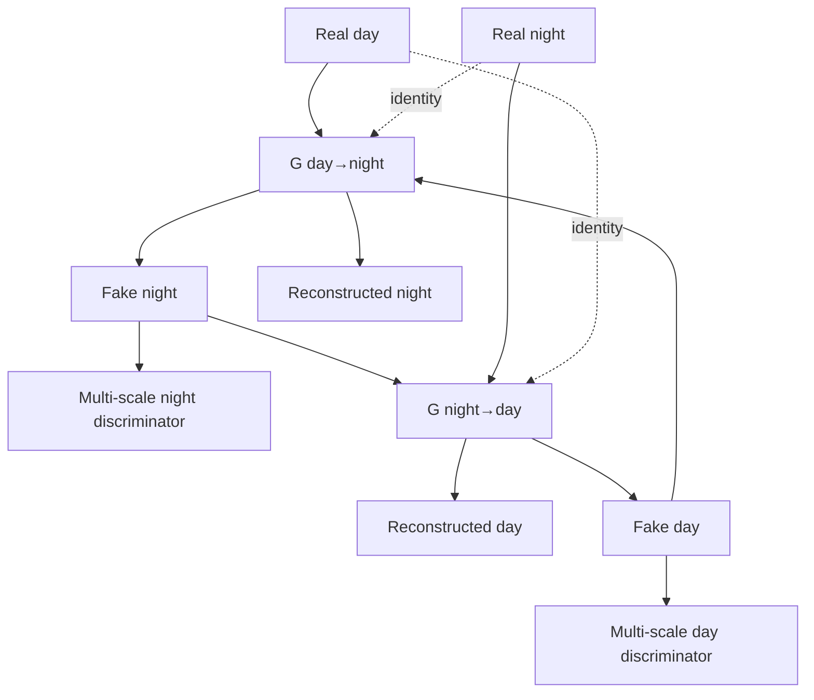
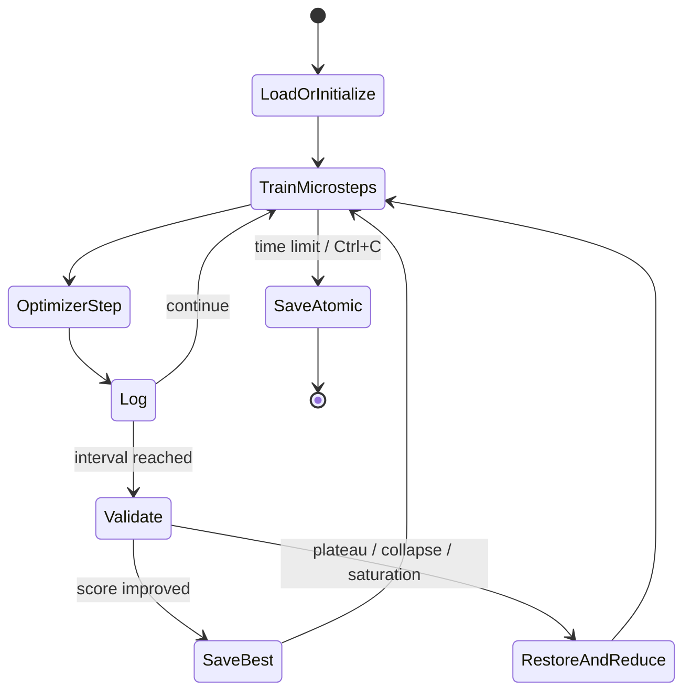

# LumiCycle Architecture

## System flow

## Bidirectional model

Each generator uses reflection padding, two downsampling stages, nine residual blocks, channel/spatial attention, two upsampling stages, and a `tanh` RGB output. LumiCycle retains CycleGAN’s cycle and identity objectives while adding:

- PatchNCE between spatial features before and after translation.
- DINOv2-S cosine distance to discourage semantic drift.
- Sobel edge distance to preserve geometry.
- Multi-scale spectral PatchGANs for global lighting and local texture.

## Training state machine

The test split has no incoming edge to training or checkpoint selection. It is opened only by the final evaluator.

