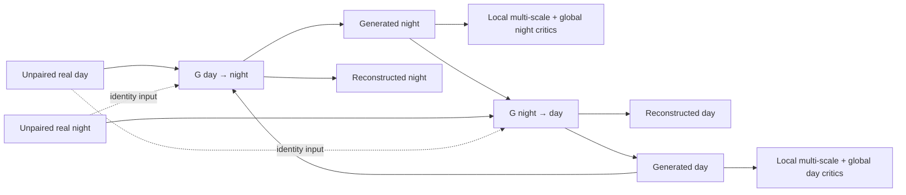
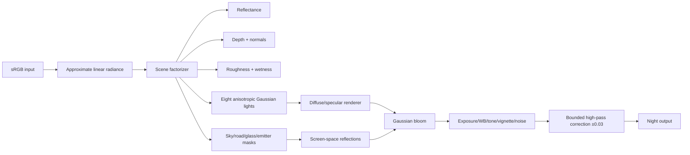

# Current Model Architecture and Experiment History

## Document purpose

This document describes the architecture that the project should currently continue from,
**LumiCycle V2**, and records the earlier and later architectures we tried. It separates what was
implemented from what was merely planned, explains why each version was introduced, and states
the remaining flaws without presenting failed experiments as improvements.

The current preferred parent checkpoint is:

```text
runs/lumicycle_v2_bdd100k/checkpoints/step_00004500.pt
```

That is the checkpoint referenced by V2's `best.json`. V2 also reached 12,000 local fine-tuning
steps, but later is not automatically better. Before another training run, the 4.5k and 12k V2
checkpoints should be compared blind on the same fixed images and the chosen parent should be
recorded by exact path and SHA-256. This matters because “V2 5.5k” has occasionally been used as
an informal label, while the repository's 5.5k checkpoint actually belongs to the failed V2.1
experiment.

## Current status in one paragraph

LumiCycle V2 is a bidirectional, unpaired CycleGAN-derived system. It has one day-to-night
generator, one night-to-day generator, a local multi-scale discriminator and whole-frame critic
for each domain, and a collection of content-preservation and illumination losses. It was
warm-started from useful V1 generator weights while its critics and optimizers were reset. It is
currently the most convincing locally trained family, especially compared with the later
LumiRender experiment, but it still has incomplete physical reasoning, branch and wire artifacts,
color fringing, road-domain bias, and an architecture whose extensive instance normalization may
remove the absolute illumination statistics that distinguish day from night.

---

## 1. Data and operating assumptions

### Primary BDD100K split

The V1/V2 family is trained on unpaired BDD100K road scenes selected from strict `daytime` and
`night` metadata:

| Split | Day | Night | Role |
|---|---:|---:|---|
| Train | 5,000 | 5,000 | Weight updates |
| Validation | 500 | 500 | Checkpoint selection |
| Test | 1,000 | 1,000 | Final reporting only |

Near-duplicate images were grouped before splitting. Day and night examples in a training batch
are generally different places and times. Therefore, the model is not given a correct nighttime
answer for each daytime input.

### Hardware and training resolution

- NVIDIA RTX 4070 Super with 12 GB VRAM
- Approximately 32 GB RAM
- BF16 mixed precision
- Physical batch size 1
- Gradient accumulation 2, giving an effective batch of approximately 2
- V2 training crop: 256 × 256 after resize to 286
- Inference can run at larger sizes, but 512–768 px inference is outside the exact training
  resolution distribution

The small training crop is important: the model can learn global road-scene appearance, but thin
branches, wires, distant lights, and text may occupy only one or two training pixels.

---

## 2. Current architecture: LumiCycle V2

### 2.1 High-level data flow



The two mappings are learned together:

- `G_day_night`: daytime RGB → nighttime RGB
- `G_night_day`: nighttime RGB → daytime RGB
- `D_night`: distinguishes generated nights from unrelated real nights
- `D_day`: distinguishes generated days from unrelated real days

Cycle reconstruction asks the composition of the two generators to return to the original image.
Identity training asks a generator to leave images already in its output domain mostly unchanged.

### 2.2 Generator, layer by layer

Both directions use the same architecture with separate weights. One generator contains
**11,447,541 trainable parameters**.

For an input tensor `B × 3 × H × W` in the range `[-1, 1]`:

| Stage | Operation | Channels | Spatial size |
|---|---|---:|---:|
| Stem | Reflection pad 3, 7×7 convolution, InstanceNorm, ReLU | 3 → 64 | H × W |
| Down 1 | 3×3 stride-2 convolution, InstanceNorm, ReLU | 64 → 128 | H/2 × W/2 |
| Down 2 | 3×3 stride-2 convolution, InstanceNorm, ReLU | 128 → 256 | H/4 × W/4 |
| Bottleneck | Nine residual blocks with CBAM attention | 256 → 256 | H/4 × W/4 |
| Up 1 | 3×3 transposed convolution, InstanceNorm, ReLU | 256 → 128 | H/2 × W/2 |
| Up 2 | 3×3 transposed convolution, InstanceNorm, ReLU | 128 → 64 | H × W |
| Head | Reflection pad 3, 7×7 convolution, `tanh` | 64 → 3 | H × W |

Each residual block is:

```text
input
  └─ reflection pad → 3×3 conv → InstanceNorm → ReLU
     → reflection pad → 3×3 conv → InstanceNorm
     → channel attention → spatial attention
  + original input
```

The channel-attention part pools every feature channel using both global average and global
maximum values. A two-layer 1×1 MLP predicts per-channel gates. Spatial attention then concatenates
the channel-wise average and maximum maps and predicts a gate with a 7×7 convolution.

Attention can emphasize useful lighting or structural features, but it is not a semantic sky,
road, light-source, or material model. It only reweights latent features.

### 2.3 Discriminators

V2 has one compound discriminator per output domain. Each contains:

1. A spectral-normalized PatchGAN at the original image scale.
2. A second spectral-normalized PatchGAN after average-pool downsampling by two.
3. A whole-frame global critic.

The local PatchGAN stack uses 4×4 convolutions with channel progression approximately
`3 → 64 → 128 → 256 → 512 → 1`. Most internal layers use InstanceNorm and LeakyReLU. The two
scales judge whether local texture patches look like the target domain.

The global critic uses four stride-2 spectral-normalized convolutional stages, adaptive global
average pooling, and a 1×1 scalar head. It was added because local patches can each look plausible
while the complete image still has an inconsistent or daytime sky.

Each V2 domain discriminator has **8,284,739 parameters**. The full V2 system has approximately
**39,464,560 parameters** across two generators and two compound discriminators.

### 2.4 Generator objectives

V2's configured loss weights are:

| Component | Weight | Intended effect |
|---|---:|---|
| LSGAN adversarial | 1.0 | Match the target-domain appearance |
| Cycle L1 | 10.0 | Permit reconstruction of the source scene |
| Identity L1 | 2.0 | Avoid changing images already in the target domain |
| PatchNCE | 1.0 | Preserve spatial content through encoder features |
| Frozen DINOv2 semantic | 0.75 | Preserve high-level scene meaning |
| Sobel edge | 2.5 | Preserve grayscale edges and geometry |
| Color statistics | 0.5 | Match target RGB/luminance means and standard deviations |
| Regional illumination | 2.0 | Match three horizontal luminance bands and the upper scene |

The total generator objective is a weighted sum over both translation directions.

#### LSGAN

The generator tries to make every local/global critic output one for generated images. LSGAN is
used instead of binary cross entropy for smoother gradients.

#### Cycle consistency

```text
day → generated night → reconstructed day
night → generated day → reconstructed night
```

An L1 loss compares each reconstruction with its source. This strongly protects layout, but can
also encourage the forward generator to retain or hide information needed by the inverse mapping.

#### Identity consistency

Real day images are passed through the night-to-day generator, and real night images through the
day-to-night generator. They should remain unchanged. Lowering this weight from V1's 5.0 to 2.0
gave V2 more freedom to transform lighting.

#### PatchNCE

Features are collected after the stem, both downsampling blocks, and selected residual blocks.
For up to 128 spatial positions per level, normalized source and translated-image features are
matched contrastively with temperature 0.07.

This implementation uses raw generator features without CUT-style learned projection heads. That
makes it simpler, but may limit feature alignment quality and makes the loss sensitive to the
generator representation itself.

#### DINOv2 semantic consistency

A frozen DINOv2 ViT-S/14 model receives source and translation resized to 224 × 224 with ImageNet
normalization. Cosine feature distance discourages gross semantic drift. It is a scene-level
constraint, not a pixel-accurate guarantee for small cars, wires, text, or branches.

#### Edge consistency

Sobel gradients are computed after converting images to grayscale. L1 distance between source and
translation edges discourages geometric changes. It does not directly detect color fringes and can
penalize legitimate edges created by lamps, reflections, or new shadows.

#### Global color statistics

The generated image is matched to an unrelated target image using RGB and luminance mean/std.
This avoids invalid pixel correspondence, but batch-one statistics are noisy and can encourage
broad color casts rather than spatially correct lighting.

#### Regional illumination

Luminance is pooled into upper, middle, and lower horizontal bands. A second term focuses on bright
upper-source pixels as likely daytime sky for day-to-night, and dark upper pixels for the reverse
direction. This helped V2 convert skies more strongly than V1, but it is a luminance heuristic—not
a learned or labeled sky mask.

### 2.5 Discriminator training and stability mechanisms

- Generator learning rate: `5e-5`
- Discriminator learning rate: `2.5e-5`
- Adam betas: 0.5 and 0.999
- Discriminators update once per two generator optimizer steps
- Gradient clipping at norm 5
- BF16 autocast
- Generated-image replay buffer of 50 samples per domain
- Differentiable brightness, saturation, and integer-translation augmentation
- EMA generator weights with decay 0.999 for validation and inference
- Validation every 500 steps and atomic checkpoints every 500 steps

V2 was initialized from the useful V1 generators but reset its critics and optimizer state. This
prevented V1's saturated discriminator state from being carried into the new experiment.

---

## 3. Why V2 is currently preferred

V2 directly addressed two V1 failures:

1. Local PatchGAN critics did not reliably enforce coherent whole-frame darkness.
2. The loss function cared more about reconstruction/structure than complete sky conversion.

The global critic and regional illumination loss produced more convincing full-image lighting and
better sky conversion on many fixed examples. Lower identity pressure and slower, less frequent
critic updates also gave the generator more freedom. The selected V2 checkpoint therefore remains
the best foundation even though it is not yet a final model.

---

## 4. Current architecture flaws

These are not minor polish issues. They are the main research problems the next revision must
address.

### 4.1 Instance normalization may erase the signal we need

The generator uses `InstanceNorm2d` after the stem, both downsampling layers, both upsampling
layers, and twice inside every residual block. The discriminators also use InstanceNorm through
most of their stacks.

Instance normalization removes each sample's channel mean and variance. For artistic style
transfer this can be useful; for day-to-night translation, absolute brightness, contrast, and
channel statistics are central evidence. Repeatedly removing them may force the network to
reconstruct illumination indirectly and can contribute to uniform tinting or incomplete lighting
changes.

The external `solesensei/day2night` VGG16/normalization ablation is therefore highly relevant. Its
promising “no normalization” result should be reproduced carefully. “No network normalization”
must not be confused with skipping the preprocessing expected by a frozen VGG16 feature model.

### 4.2 The network has no semantic sky or emitter pathway

The upper-scene heuristic assumes bright pixels near the top are sky. It cannot reliably separate:

- sky from bright buildings;
- cloud from glare;
- tree canopy from open sky;
- windows and lamps from reflected highlights.

The generator is never explicitly told which region is sky, where local lights are plausible, or
where reflections may occur. All of those effects must emerge implicitly from adversarial data.

### 4.3 Structure losses can suppress the desired transformation

Cycle 10, PatchNCE 1, DINO 0.75, edge 2.5, and identity 2 collectively exert strong pressure to
retain the input. That protects objects, but night translation genuinely requires large changes to
sky luminance, shadow structure, highlight clipping, and local light sources. V2.1 demonstrated the
failure mode: adding still more structural objectives can preserve detail while destroying the
nighttime effect.

### 4.4 Unpaired supervision is ambiguous

The real night image in a batch is not the same scene as the daytime input. Global color and
illumination targets therefore come from an unrelated photograph with different weather, camera,
road, and light distribution. The model can minimize distributional losses using shortcuts such as
darkening, warming, or adding a common color cast.

### 4.5 The discriminators can reward shortcuts

Patch critics judge local realism but do not know which source pixel or object they should
preserve. The global critic sees the full frame but has no semantic conditioning. Neither critic
explicitly asks: “Did the sky become night while this exact branch remain unchanged?”

Brightness and saturation DiffAugment further make the critic invariant to some lighting/color
differences. That is useful against overfitting, but potentially counterproductive when illumination
and color are the domain distinction.

### 4.6 Quarter-resolution bottleneck without long skip connections

The generator compresses the scene to H/4 × W/4 and has no U-Net-style encoder-to-decoder skip
connections. Residual blocks preserve bottleneck information, but thin branches, wires, text, and
distant lights may be lost during downsampling and reconstructed imperfectly.

V2.1 tried to repair this after the fact with a high-frequency refiner and failed to retain the
primary lighting transformation. The next solution should preserve detail without allowing detail
losses to dominate the domain change.

### 4.7 Transposed-convolution upsampling can produce artifacts

Both upsampling stages use learned transposed convolutions. Uneven kernel overlap can contribute to
checkerboard or ringing patterns. Resize-convolution or anti-aliased upsampling is worth testing in
a controlled warm-start-compatible adapter.

### 4.8 PatchNCE is simplified

The implementation lacks separate learned feature projection heads and samples raw encoder
features. It also matches features produced by encoding the generated image again, which may permit
the generator to shape both sides of the representation. The loss is useful but weaker than a full
carefully designed contrastive pipeline.

### 4.9 DINO and Sobel miss important local failures

DINO receives 224 px images and produces a high-level feature constraint. Sobel operates in
grayscale. Together they can miss:

- red/cyan fringes around branches;
- small text corruption;
- lamp placement errors;
- local texture hallucination;
- thin-wire disappearance;
- implausible reflections.

### 4.10 One deterministic answer cannot represent nighttime ambiguity

V2 maps each input to one deterministic output. It cannot choose between dry/wet surfaces,
different window illumination patterns, lamp colors, or exposure settings. Stochasticity is not
mandatory for a good result, but a future local-light branch may need controlled, reproducible
variation.

### 4.11 Road-domain bias

BDD100K is dominated by dashcam road scenes. V2 can produce an acceptable transformation on some
landscapes, but it was not trained to cover arbitrary outdoor photographs. Generalization claims
must remain limited until broader datasets and category-balanced evaluation are added.

### 4.12 Validation is incomplete

The selected V2 checkpoint is based on the implemented validation score and qualitative review,
not a finished, publication-grade evaluation with complete FID/KID, sky metrics, detector
consistency, and blinded human preference. The scoring function itself can prefer structural
fidelity over nighttime realism. A checkpoint called “best” is only best under that score.

---

## 5. Previous architectures

### 5.1 Standard CycleGAN baseline

#### Architecture

- Two 9-block ResNet generators with InstanceNorm
- One 70×70-style PatchGAN discriminator per domain
- No attention
- No multi-scale or whole-frame critic
- GAN 1, cycle 10, identity 5
- Approximately 28.27 million total parameters

#### Why it was not enough

Cycle and identity losses preserve coarse geometry, but the local discriminator is weak at judging
global sky/exposure coherence. There is no explicit semantic, edge, contrastive, or illumination
constraint. It provides an important conceptual baseline, but a complete retained main-run
checkpoint is not currently available, so the project must not invent comparative numbers.

### 5.2 LumiCycle V1

#### Architectural changes

- CBAM channel/spatial attention inside all nine bottleneck residual blocks
- Two-scale spectral-normalized PatchGAN per domain
- PatchNCE over multiple encoder depths
- Frozen DINOv2 semantic consistency
- Sobel edge consistency
- EMA inference
- Approximately 33.95 million total parameters

#### Training and result

- Trained for 40,000 steps at 256 px
- Best retained checkpoint: step 13,000
- Step 13k validation score approximately 0.2306
- Final score around 0.2814, demonstrating later degradation
- Discriminator accuracy near 0.989 around the best point, suggesting saturation

#### Why it was not enough

V1 generated obvious nighttime appearance and often preserved scene layout, but produced incomplete
sky conversion, halos, and red/cyan fringing around branches and lights. Local critics could be
satisfied without coherent global illumination. Strong identity and reconstruction pressure also
limited the transformation. Continuing the same run did not help because later checkpoints were
worse and the learning-rate schedule was exhausted.

### 5.3 LumiCycle V2.1 detail refinement

#### Architecture

V2.1 wrapped each V2 generator in a two-level Laplacian refinement system:

- V2 produced a coarse translation.
- Source and coarse outputs were decomposed into Gaussian/Laplacian bands.
- Zero-initialized refiners received source band, coarse band, translated low-frequency context,
  and source Sobel gradients.
- Each refiner predicted a transfer mask and a bounded residual.
- Separate Haar-frequency PatchGANs judged LH/HL/HH bands.
- Wavelet, self-similarity, and residual-preservation losses were added.
- Detail-biased sampling selected more high-frequency examples.
- Approximately 41.10 million total parameters.

Training began from V2 step 4,500. The base was frozen during a 256 px warm-up, followed by very
low-LR 384 px fine-tuning. Best pointer: V2.1 step 5,500; final: 6,000.

#### Why it failed

The new objectives optimized the symptom—edge mismatch—more strongly than the actual task. Fine
structure was protected, but the night transformation weakened toward daylight/twilight. The
refiner could only modify high-frequency bands, while the needed sky and illumination corrections
were low-frequency. This is an important negative result: preserving every source frequency is
not compatible with changing illumination unless losses are region- and task-aware.

### 5.4 LumiRender physics-guided renderer

#### Architecture

LumiRender discarded V2 and trained a new one-way day-to-night system from scratch:



It had approximately 3.36 million generator parameters and 3.11 million discriminator parameters.
It used cached depth/semantic pseudo-labels, Dark Zurich/AMOS aligned pairs, ACDC night images, and
BDD100K. Training progressed through factorization, physics synthesis, correspondence, and real
night refinement, finally stopping safely at step 34,004.

#### Why it failed

The result mainly reduced brightness and saturation. It did not convincingly transform the sky or
activate its local light/reflection machinery.

The architecture made the trivial solution easy:

- optical-flow confidence was almost empty in many pairs and especially unreliable on sky;
- reconstruction and semantic constraints rewarded retaining the input;
- the emitter-validity loss penalized misplaced lights, so weak lights were safer than useful ones;
- PatchGAN could accept broad darkening as a nighttime cue;
- the correction network was forbidden from changing coarse illumination;
- the analytic parameter ranges were too restrictive;
- the factorizer was frozen during final refinement, locking in errors.

LumiRender should remain documented as a failed ablation. Increasing its resolution would sharpen
the same failure rather than fix its objective.

---

## 6. Architecture comparison

| Version | Generator | Critics per domain | Key additions | Best/important checkpoint | Outcome |
|---|---|---|---|---|---|
| CycleGAN | 9-block ResNet | One PatchGAN | Cycle + identity | No complete main checkpoint retained | Baseline only |
| V1 | Attention ResNet | Two-scale PatchGAN | PatchNCE, DINO, edge, EMA | 13k | Convincing night, but halos/sky/fringing issues |
| **V2 current** | Same V1 generator | Two-scale + global | Color and regional illumination, lower identity, slower critics | **4.5k selected; 12k final** | Strongest current parent |
| V2.1 | V2 + Laplacian refiners | V2 critics + Haar critics | Wavelet and self-similarity | 5.5k/6k | Detail objectives weakened night effect |
| LumiRender | Factorizer + analytic renderer | Two-scale night critic | Gaussian lights/reflections/camera | 34,004 | Mostly global darkening; failed |

---

## 7. Safe direction for the next architecture

The next revision should be a controlled continuation of V2, not another unrelated model trained
blindly for tens of thousands of steps.

### Required migration properties

1. Load the exact chosen V2 generator and EMA tensors.
2. Keep old paths unchanged at initialization.
3. Add new modules with zero or identity initialization.
4. Reset critics and optimizers if their architecture changes.
5. Produce the exact V2 output at new-model step zero within numerical tolerance.
6. Preserve the global step lineage in metadata even if the new experiment has a local counter.

### Highest-priority controlled experiments

#### A. Normalization ablation

Investigate the external VGG16/no-normalization result. Test normalization removal or replacement
without immediately rewriting the whole generator. Candidate approaches include identity-initialized
normalization bypasses, selective removal in the first/last and residual paths, affine-free versus
affine normalization, weight normalization, or illumination-preserving conditional modulation.

The experiment must distinguish:

- normalization layers inside the translation network; and
- ImageNet mean/std preprocessing required by frozen VGG16/DINO feature extractors.

#### B. Correctly preprocessed VGG perceptual supervision

Use frozen VGG16 features at selected shallow/mid layers to preserve spatial appearance while
allowing low-frequency illumination change. Avoid a single large perceptual weight. Compare it
against DINO and determine whether one, both, or region-specific combinations are useful.

#### C. Sky-aware low-frequency branch

Add a sky/background branch that can alter coarse illumination independently of the detail path.
It should use real or reliable pseudo sky masks and must not rely on optical-flow confidence in
textureless regions. Branch/wire preservation should be enforced at the sky-foreground boundary.

#### D. Sparse local-light residual

Add local light/emission capability only after global night conversion works. Train it with positive
light examples and an anti-hallucination constraint. Do not repeat LumiRender's strategy of mostly
penalizing invalid lights without rewarding correct active emitters.

### Pilot discipline

- 1,000–2,000 steps per isolated change
- Fixed images every 250–500 steps
- Always include open sky, branches/wires, vehicles, wet road, buildings, and landscape
- Compare against the frozen V2 parent at every checkpoint
- Stop early if the result merely darkens, weakens the sky conversion, introduces fringes, moves
  objects, or loses on a blind comparison
- Do not increase to 640 px until the transformation works at 256–384 px

---

## 8. Honest conclusion

LumiCycle V2 is not a finished solution, but it is the best reusable foundation produced by the
project. V1 established that attention plus semantic/edge/contrastive protection can create a
convincing night domain. V2 improved global darkness and sky conversion. V2.1 showed that adding
frequency preservation can suppress the task itself. LumiRender showed that an interpretable
physics story does not help when supervision lets the system choose global darkening.

The next improvement should focus on the actual bottlenecks—normalization, semantic sky control,
local light supervision, and the balance between structural fidelity and illumination change—while
retaining the useful V2 weights and using short visual gates before any long training run.
